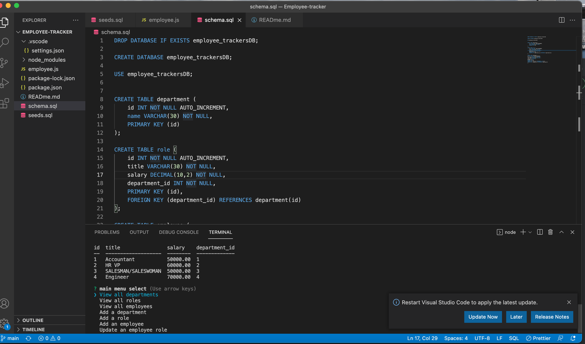

# Employee Tracker
   
  * [Information](#information)
  * [Installation](#installation)
  * [Usage](#usage)
  * [Usefulness](#usefulness)
  * [Test](#test)
  * [Questions](#questions)
  * [License](#license)
  
  # Information
  ~ there is Information, Installation, Usage, Usefulness, Test, Questions and License
  

  # Installation
  ~ The project will be created using node, mysql, and a package of inquirer. It will be created through JavaScript.

  
  # Usage
  ~ The project will be useful for generating a chart of employees and being able to add employees for a company or a certain department. 
  A video for the project can be viewed at https://drive.google.com/file/d/14mYCbKdjqTI2PJfg0Hm1uKEFl9Qew_LE/view

  # Usefulness
  ~ This project will be useful for practicing working with node and mysql. It is also useful to design a project team and create either a role, department or add an employee.
  
  # Test 
  ~ It will be tested through node and will be developed in the back end and will be using schema in order to create charts to run the information. This will help generate a page to complete information. 
  
  # Questions
   This will be standard for setting up a design team online.
  * Feel free to reach out to my email: hello1234@gmail.com
  * To see more of my work check out my github! The username is: connerc11
  * Also click the link to have easy access to the Github! (https://github.com/connerc11)

   